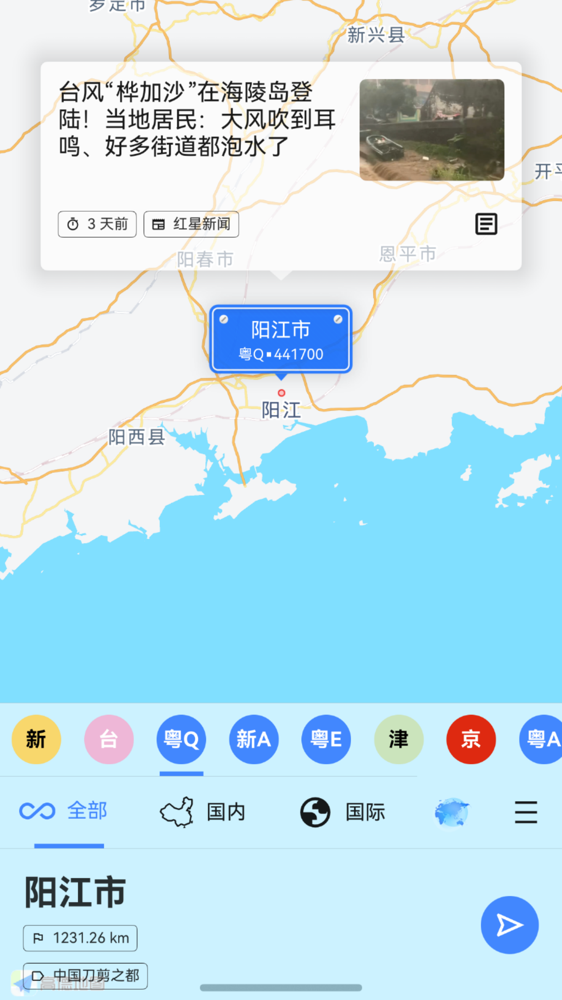
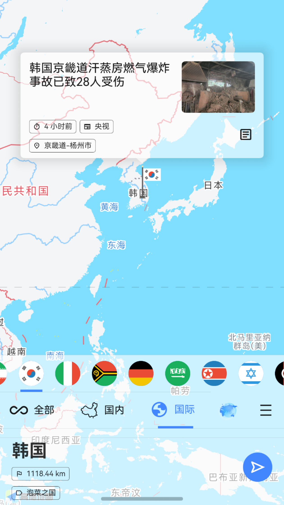
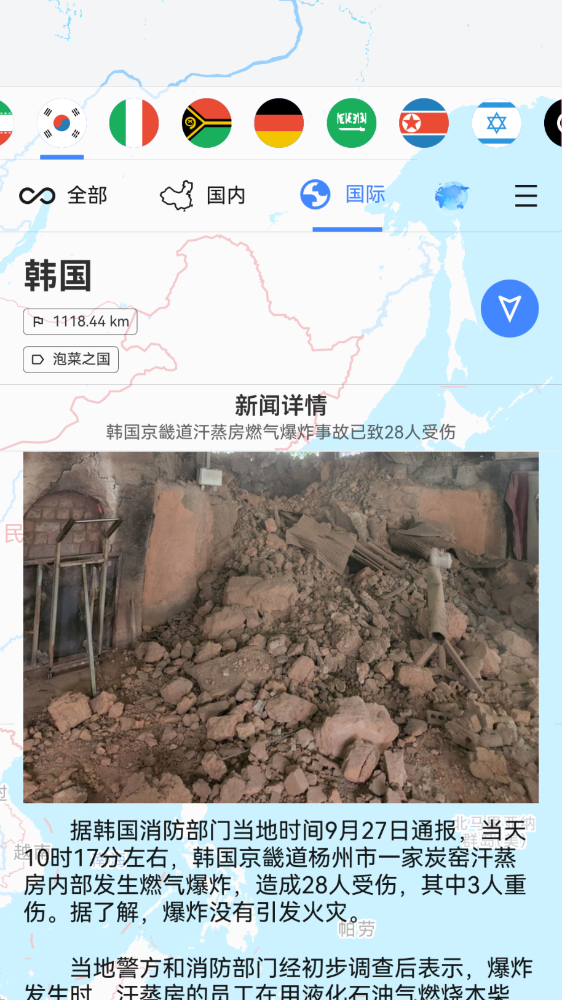

## 项目灵感-中央电视台节目-新闻地图
<iframe width="100%" height="600" src="//player.bilibili.com/player.html?isOutside=true&aid=523404430&bvid=BV1wM411B7HA&cid=982015599&p=1" scrolling="no" border="0" frameborder="no" framespacing="0" allowfullscreen="true" &autoplay=0></iframe>

## 首页
[img draft_edit]: ./images/省级新闻.png "草稿编辑"
![50w][img draft_edit]

- 新闻来源均是来自第三方平台，本应用不发布任何非官方资讯
- AI识别新闻发生地
- 可自由选择国际或者国内新闻
- 省份新闻用每一个省份简称表示，背景用不同颜色区分
- 地级市新闻用与车牌号的蓝色背景，并直接使用该地车牌号，这样更加有代入感
- 每一个地方可以显示与你当前距离，直观让你感受到，一条新闻的发生与你的距离，更加体现出一种家事国事天下事，每一件都与自己有关
- 每一个国家，省份，城市都集成了地方标签，让你更加了解这个地方
  - 省份的标签灵感来自初中地理书上的介绍，例如四川（天府之国），真的很帅。
  - 这个app立项的时候遇到了疫情，发现为了援助湖北，每一个省都有一个援助口号，这个真的太帅了，必须用上
- 新闻都是实时更新

## 地级市级别的新闻

## 国家级别的新闻

## 新闻详情

## 视频新闻
> 流程全自动采集生成，AI剪辑

## 视频演示

> 这里演示用的是安卓。。。

<iframe width="100%" height="600" src="//player.bilibili.com/player.html?isOutside=true&aid=114958037686998&bvid=BV1jwhhz3En2&cid=31438998269&p=1" scrolling="no" border="0" frameborder="no" framespacing="0" allowfullscreen="true"></iframe>

