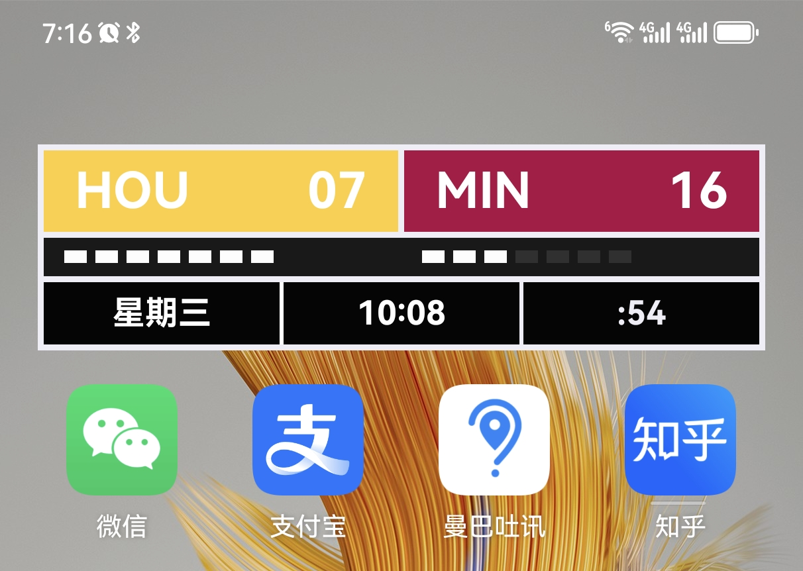

::github{repo="dianbaiyizhong/nba-widgets"}


## 预览图


## 视频演示
<iframe  width="100%" height="600px" src="//player.bilibili.com/player.html?isOutside=true&aid=113610609203673&bvid=BV1ntq5YrEsE&cid=27223982740&p=1" scrolling="no" border="0" frameborder="no" framespacing="0" allowfullscreen="true"></iframe>


## Admonitions

Following types of admonitions are supported: `note` `tip` `important` `warning` `caution`

:::note
Highlights information that users should take into account, even when skimming.
:::

:::tip
Optional information to help a user be more successful.
:::

:::important
Crucial information necessary for users to succeed.
:::

:::warning
Critical content demanding immediate user attention due to potential risks.
:::

:::caution
Negative potential consequences of an action.
:::

### Basic Syntax

```markdown
:::note
Highlights information that users should take into account, even when skimming.
:::

:::tip
Optional information to help a user be more successful.
:::
```

### Custom Titles

The title of the admonition can be customized.

:::note[MY CUSTOM TITLE]
This is a note with a custom title.
:::

```markdown
:::note[MY CUSTOM TITLE]
This is a note with a custom title.
:::
```

### GitHub Syntax

> [!TIP]
> [The GitHub syntax](https://github.com/orgs/community/discussions/16925) is also supported.

```
> [!NOTE]
> The GitHub syntax is also supported.

> [!TIP]
> The GitHub syntax is also supported.
```

