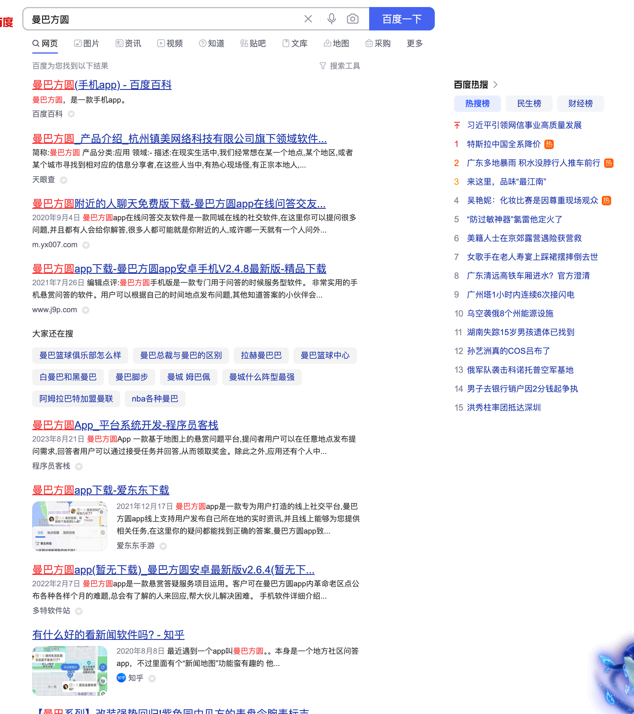
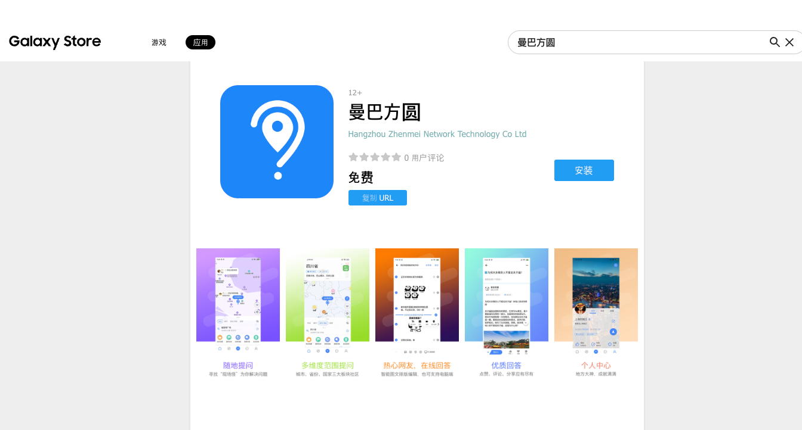
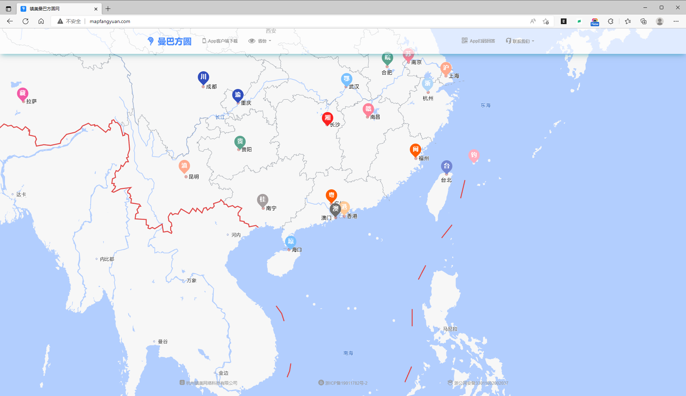

开发时间
> 2018年10月-2020年3月

## 视频演示

<iframe width="100%" height="600" src="//player.bilibili.com/player.html?isOutside=true&aid=115324754139047&bvid=BV13nxVzqET4&cid=32868729520&p=1" scrolling="no" border="0" frameborder="no" framespacing="0" allowfullscreen="true" &autoplay=0></iframe>

## 推广效果

## 三星应用商店
> 居然还没下架，哈哈（不过服务器早就over了）
https://galaxystore.samsung.com/detail/com.zhenmei.p7i

## pc端

## 移动端web

